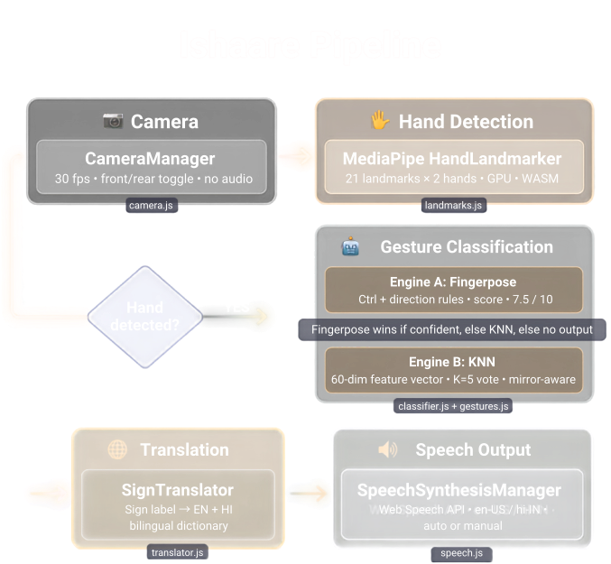

<h1 align="center">
  Ishaare — इशारे
</h1>

<p align="center">
  <strong>Free real-time sign language to speech converter — ASL hand gestures to spoken English &amp; Hindi</strong><br/>
  Works offline in your browser. No install needed. Powered by Google MediaPipe.
</p>

<p align="center">
  <a href="https://ishaare-se-shabad.vercel.app/" target="_blank">
    
  </a>
</p>

<p align="center">
  
  
  
  
  
</p>

---

## What is Ishaare?

**Ishaare** (Hindi: "gestures") is a browser-based Progressive Web App that uses your device's camera to recognize hand signs in real time and converts them into spoken English or Hindi using text-to-speech.

It runs entirely on-device — no data is ever sent to a server.

---

## How It Works — Pipeline



The app runs a 5-stage real-time pipeline entirely in your browser:

| # | Stage | Module | What it does |
|---|-------|--------|--------------|
| 1 | 📷 **Camera** | `camera.js` | Streams webcam at 30 fps; supports front/rear toggle |
| 2 | 🖐 **Hand Detection** | `landmarks.js` | [MediaPipe HandLandmarker](https://ai.google.dev/edge/mediapipe/solutions/vision/hand_landmarker) maps 21 landmarks × 2 hands |
| 3 | 🤖 **Classification** | `classifier.js` + `gestures.js` | **Engine A** ([Fingerpose](https://github.com/andypotato/fingerpose)) rule-based curl/direction matching (score ≥ 7.5); **Engine B** (KNN) for custom trained signs |
| 4 | 🌐 **Translation** | `translator.js` | Sign label → natural sentence in English + Hindi |
| 5 | 🔊 **Speech** | `speech.js` | [Web Speech API](https://developer.mozilla.org/en-US/docs/Web/API/SpeechSynthesis) speaks result in `en-US` or `hi-IN` |

> Everything runs **100% offline** after the first load — no data leaves your device.

---

## Features

- Real-time hand landmark detection via Google MediaPipe
- Pre-built gesture library (A-Z ASL letters + common phrases like HELLO, THANK YOU, YES, NO, etc.)
- Custom sign training — record your own signs using a K-Nearest Neighbour classifier, directly in the browser
- Text-to-speech output in English and Hindi
- Works offline as a PWA (installable on mobile)
- Mobile-first — optimized for iOS/Android cameras
- Image Trainer — train new signs from photos/screenshots

---

## Tech Stack

| Layer | Technology |
|---|---|
| Hand Tracking | [MediaPipe Tasks Vision](https://developers.google.com/mediapipe) |
| Gesture Recognition | [Fingerpose](https://github.com/andypotato/fingerpose) + custom KNN |
| Build Tool | [Vite 5](https://vitejs.dev/) |
| Text-to-Speech | [Web Speech API](https://developer.mozilla.org/en-US/docs/Web/API/Web_Speech_API) |
| PWA | Service Worker + Web App Manifest |

---

## Getting Started

### Prerequisites
- [Node.js](https://nodejs.org/) v18+
- npm v9+

### Installation

```bash
# Clone the repository
git clone https://github.com/YOUR_USERNAME/ishaare.git
cd ishaare

# Install dependencies
npm install
```

### Run Locally

```bash
npm run dev
```

> **HTTPS required:** Camera access requires HTTPS. The dev server uses `@vitejs/plugin-basic-ssl` to serve over HTTPS automatically. Accept the self-signed certificate warning in your browser.

Open `https://localhost:5173` (or the network URL shown in the terminal for mobile testing).

### Build for Production

```bash
npm run build
```

Output will be in the `dist/` folder. Deploy to any static host (GitHub Pages, Vercel, Netlify, etc.).

---

## Supported Built-in Signs

**ASL Alphabet:** A, B, C, D, E, F, G, H, I, J, K, L, M, N, O, P, Q, R, S, T, U, V, W, X, Y, Z

**Common Phrases:** HELLO, THANK YOU, YES, NO, I LOVE YOU, PEACE, OK, STOP

> You can also **train custom signs** directly in the app — no coding required.

---

## Training Custom Signs

1. Click the **"Train"** button in the app
2. Enter a label (e.g., `WATER` or `HELP`)
3. Hold the gesture and click **"Record Sample"** (or use **Multi-Shot** for more samples)
4. Repeat for different angles
5. **Export** your training data as JSON to back it up

A pre-built training dataset is included at `training/default-training.json`.

---

## Project Structure

```
ishaare/
├── src/
│   ├── main.js          # App coordinator & RAF loop
│   ├── camera.js        # Camera/webcam management
│   ├── landmarks.js     # MediaPipe hand landmark detection
│   ├── classifier.js    # Fingerpose + KNN gesture classifier
│   ├── gestures.js      # Custom Fingerpose gesture definitions
│   ├── translator.js    # English to Hindi translation
│   └── speech.js        # Web Speech API wrapper
├── assets/
│   └── icon.png         # PWA icon
├── training/
│   └── default-training.json  # Pre-built KNN training dataset
├── index.html           # Main app
├── image-trainer.html   # Standalone image-based trainer
├── style.css            # App styles
├── sw.js                # Service worker (PWA offline support)
├── manifest.json        # PWA manifest
└── vite.config.js       # Vite + HTTPS config
```

---

## Configuration

| Setting | Default | Description |
|---|---|---|
| Min Confidence | 7.5 / 10 | Minimum gesture score to accept a detection |
| Auto-Speak | Off | Automatically speak detected signs |
| Voice | System default | Choose from available TTS voices |

---

## Deployment

Since this is a static Vite app, you can deploy it anywhere:

- **Vercel**: `vercel deploy`
- **Netlify**: Drag and drop the `dist/` folder
- **GitHub Pages**: Push the `dist/` folder or use a GitHub Actions workflow

> For production, replace `@vitejs/plugin-basic-ssl` with a real TLS certificate. HTTPS is required for camera access on all browsers.

---

## Contributing

Contributions are welcome!

1. Fork the repository
2. Create a feature branch: `git checkout -b feature/my-sign`
3. Add your gesture in `src/gestures.js` following the existing pattern
4. Commit and open a Pull Request

---

## License

MIT - see [LICENSE](LICENSE) for details.

---

Made with ❤️ for accessible communication — bridging the gap between sign language and spoken word.

---

## GitHub Topics

> Add these topics to your GitHub repository for better discoverability:
> `sign-language` · `asl` · `accessibility` · `mediapipe` · `pwa` · `speech-recognition` · `hindi` · `hand-gesture-recognition` · `web-app` · `offline-first` · `fingerpose` · `real-time` · `deaf` · `communication`

*(Go to your repo → ⚙️ Settings / About gear icon → Topics → paste the tags above)*

